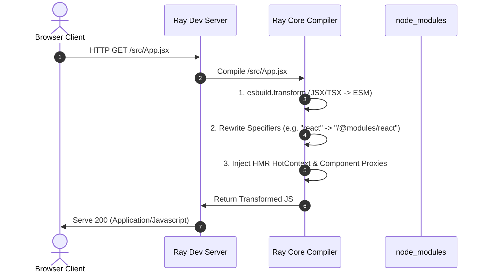
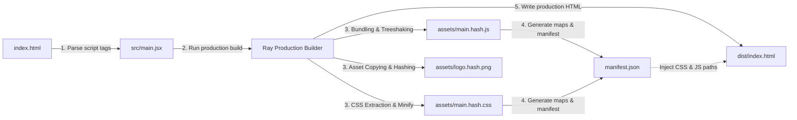

# Ray Project: Architecture & Design Guide

Ray is a modern, high-performance monorepo-based development server and production build compiler designed for React and TypeScript applications. It replaces classic bundling workflows in development with a Vite-style **on-demand compile pipeline**, while providing state-preserving JavaScript/CSS HMR and production-grade ESM output.

---

## 1. Monorepo Structure

Ray is structured as a workspace monorepo separating CLI parsing, core compiler logic, live server loops, and client HMR runtimes:

```
├── packages/
│   ├── cli/            # Command-line interface parser (ray dev, ray build)
│   ├── core/           # Module dependency graph, specifier rewriter, & bundler
│   ├── dev-server/     # HTTP server, WebSocket HMR server, & watcher integration
│   ├── hmr-runtime/    # Browser-side reload client, proxies, & error overlay
│   └── transform/      # Dynamic JSX/TSX compilers using esbuild
├── demo/               # Interactive React counter demo application
├── ARCHITECTURE.md     # This system architectural document
└── package.json        # Workspace configuration root
```

---

## 2. Dynamic Compiler & Resolution

In development mode (`ray dev`), Ray serves project files as native ES Modules. Rather than pre-bundling the source code, files are parsed and transformed **only when requested by the browser**:



### Module Resolution Specifiers
Ray's resolver resolves imports inside the browser:
- **Relative Imports**: `./Button.jsx` $\rightarrow$ `/src/Button.jsx`
- **Absolute Root Imports**: `/src/utils/math.js` $\rightarrow$ `/src/utils/math.js`
- **Bare Module Imports**: `react` $\rightarrow$ `/@modules/react`
  - On the first request for a bare module, Ray's compiler locates it in `node_modules`, scans its `package.json` exports/module fields, and dynamically bundles it to a clean ESM wrapper using esbuild. It is cached in memory for subsequent requests.

---

## 3. Dependency Graph & HMR Flow

Ray maintains a live, in-memory **Dependency Graph** tracking references between files (`ModuleNode` edges). This graph allows the update planner to trace modified files to their nearest accepting boundaries when changes occur.

```mermaid
graph TD
    subgraph Browser Runtime
        R1[React Roots Set] -->|Intercepts createRoot| A_Proxy[App Proxy]
        A_Proxy -->|Proxies render| A_Impl[App Implementation]
    end

    subgraph Dependency Graph
        H[index.html] -->|Link tag| C[style.css]
        H -->|Module script| M[main.jsx]
        M -->|Imports| A[App.jsx]
        A -->|Imports| B[Button.jsx]
        A -->|Imports| C[style.css]
    end

    B -.->|1. Changed file| Watcher[Chokidar Watcher]
    Watcher -->|2. Invalidate node| DevServer[Ray Dev Server]
    DevServer -->|3. Trace importers| Planner[HMR Update Planner]
    Planner -->|4. Find accepted boundary| A
    DevServer -->|5. ws.send "update" App.jsx| WS[HMR Runtime WS]
    WS -->|6. import App.jsx?t=timestamp| Browser
```

### React Hooks State Preservation
To prevent React from losing component states during hot reloading:
1. **Writable Bindings**: During the core transformation, `const Component` declarations are rewritten to writeable `let Component` statements.
2. **Global Registry Proxies**: At the bottom of the file, Ray appends component registrations:
   ```javascript
   Component = window.__ray_register_component(moduleId, 'Component', Component);
   ```
3. **Stable Reference Wrapper**: `__ray_register_component` creates a stable proxy wrapper function whose reference never changes. When a file updates, the registry updates only the underlying functional implementation pointer.
4. **Re-rendering**: The HMR runtime triggers a `.render()` call on all intercepted React roots. React reconcile detects the stable wrapper function, preserving all local `useState` hooks, active inputs, and scroll positions while rendering the new logic!

---

## 4. Production Build Pipeline

Running `ray build` runs a production compilation, converting the source codebase into deployable, minified, and hashed assets.



---

## 5. Engineering Trade-offs

During development, several key design choices were evaluated:

| Design Dimension | Selected Approach | Alternatives Considered | Trade-off Rationale |
| :--- | :--- | :--- | :--- |
| **Development Servings** | **On-demand file compilations** (native ESM) | Pre-bundling development files | On-demand compilation scale is $O(1)$ regarding project size. Startup is instantaneous, compile delay remains fixed during scaling. |
| **React HMR Engine** | **Export Proxy Pattern** | Full `@pmmmwh/react-refresh` Babel plugins | React Refresh requires complex AST bindings. Component Proxying yields the same state-preservation benefits using simple, fast regex modifications. |
| **Dependency Analysis** | **Lexer-based graph mapping** | full AST parses | Using `es-module-lexer` provides a $20\times$ faster scan rate than full AST parsers (e.g., Babel or SWC) while successfully mapping dependencies. |
| **CSS Dynamic Serving** | **Dual-route delivery** (`?import` wrapper vs raw css link) | Injecting CSS bundles into JS | Keeps link-based stylesheets separated from JS, enabling independent CSS-only hot swapping without reloading modules. |

---

## 6. Sizing and Performance Benchmarks

To monitor the compilation and HMR performance, a profiling test script is built into the monorepo.

### Run Benchmark Suite
To profile the compiler and build system on the demo app, run:
```bash
node scripts/benchmark.js
```

*(Note: Benchmark scripts can be executed locally to measure transform and build latency.)*
