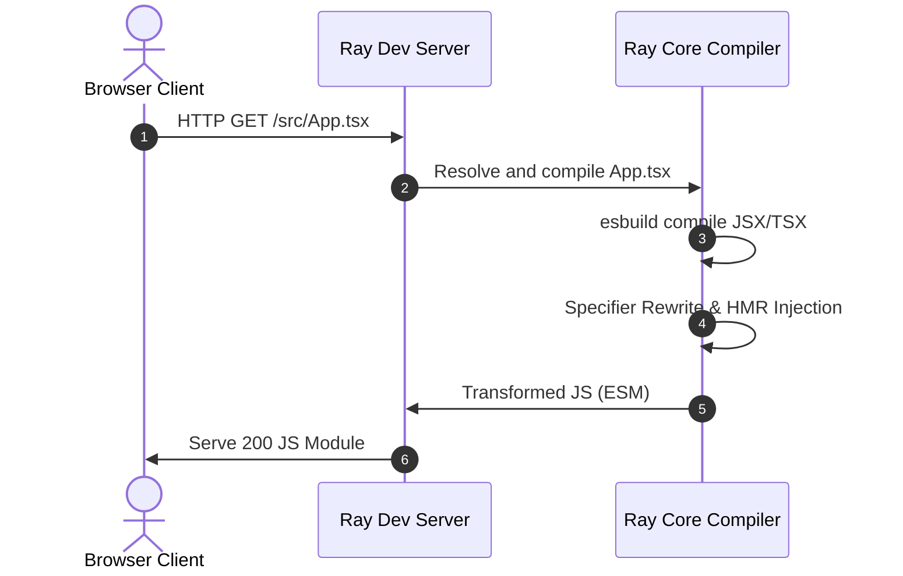
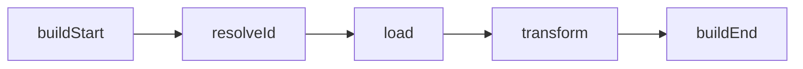
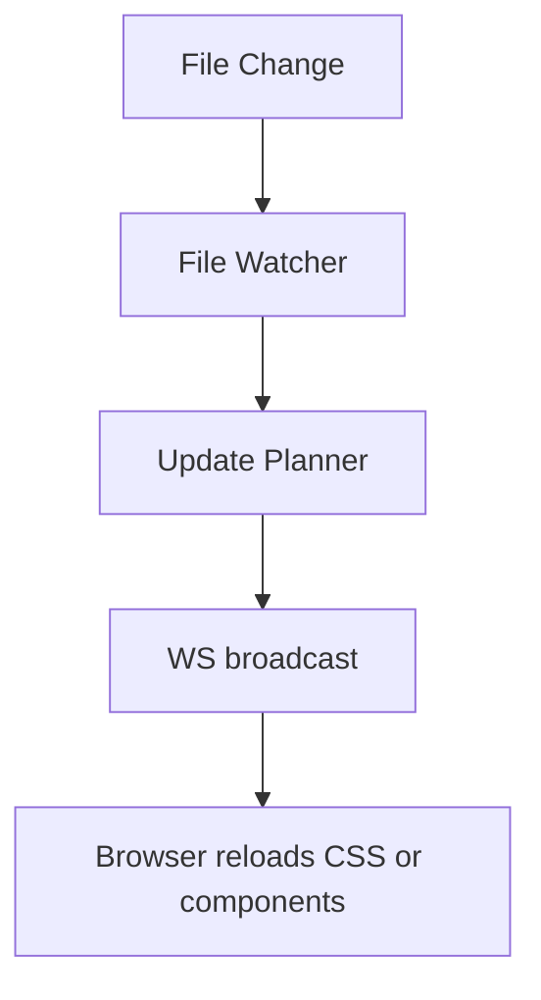

# Ray v1.0 Production Documentation

Welcome to Ray, a modern, high-performance web development build tool and server ecosystem designed for React and TypeScript applications.

---

## 1. Getting Started

### Installation
Add Ray to your React project:
```bash
npm install -D @ray/cli @ray/core
```

### Scaffolding
Create a new project from scratch:
```bash
ray create my-app --template react-ts
```

### Scripts Setup
Add the following commands to your `package.json`:
```json
"scripts": {
  "dev": "ray dev",
  "build": "ray build",
  "preview": "ray preview",
  "verify": "ray verify"
}
```

---

## 2. Compatibility Matrix

Ray is fully tested and hardened to support the following environments:

| Tech Dimension | Supported Versions / Systems |
| :--- | :--- |
| **Node.js** | `>= 18.0.0` (Recommended: `v20`, `v22`, `v24`) |
| **React** | `^18.2.0` |
| **TypeScript** | `>= 5.0.0` |
| **Package Managers** | `npm`, `pnpm`, `yarn` |
| **Operating Systems** | Windows, Linux, macOS |

---

## 3. Architecture Diagrams

### Request Pipeline


### Module Graph
```mermaid
graph TD
    index.html --> main.tsx
    main.tsx --> App.tsx
    App.tsx --> Button.tsx
    App.tsx --> style.css
```

### Plugin Lifecycle


### HMR Flow


---

## 4. CLI Reference

```
Usage:
  ray dev             Start the live dev server
  ray dev --ssr       Start the live dev server with Server-Side Rendering
  ray dev --port N    Start the dev server on port N
  ray build           Compile the project for production
  ray build --ssr     Compile the project for SSR production deployments
  ray build --ssg     Generate static HTML pre-rendered pages (SSG)
  ray preview         Serve static production build from dist/
  ray create <name>   Scaffold a new project (templates: react, react-ts, react-ssr, library)
  ray verify          Perform full project diagnostic checks
  ray release         Publish automation pipeline (bumping version, changelog, tagging)
```

---

## 5. Plugin API

Ray's universal plugin system supports the following hooks:

```typescript
export interface RayPlugin {
  name: string;
  enforce?: 'pre' | 'post';
  resolveId?(id: string, importer?: string): Promise<string | null> | string | null;
  load?(id: string): Promise<string | null> | string | null;
  transform?(code: string, id: string): Promise<{ code: string; map?: any } | string> | { code: string; map?: any } | string;
  buildStart?(): Promise<void> | void;
  buildEnd?(): Promise<void> | void;
}
```

---

## 6. Guides

### SSR & Hydration Guide
To run Ray in SSR mode, run:
```bash
ray dev --ssr
```
Your entrypoint must contain:
1. `src/entry-client.jsx` for hydrating React components:
   ```javascript
   import ReactDOM from 'react-dom/client';
   import { App } from './App';
   ReactDOM.hydrateRoot(document.getElementById('root'), <App />);
   ```
2. `src/entry-server.jsx` for rendering HTML string on the server:
   ```javascript
   import ReactDOMServer from 'react-dom/server';
   import { App } from './App';
   export function render() {
     return { html: ReactDOMServer.renderToString(<App />) };
   }
   ```

### Library Mode Guide
To bundle a package as a reusable library:
```bash
ray build --lib --entry src/index.ts --name MyLib
```

---

## 7. FAQ

**Q: Does Ray support hot reloading for CSS?**
A: Yes, Ray monitors CSS changes and updates the DOM stylesheets dynamically without reloading the JavaScript execution context.

**Q: Can I use environment variables in the client browser bundle?**
A: Only variables prefixed with `RAY_` are compiled into browser-side code; all other variables are replaced with `undefined` to ensure security.
