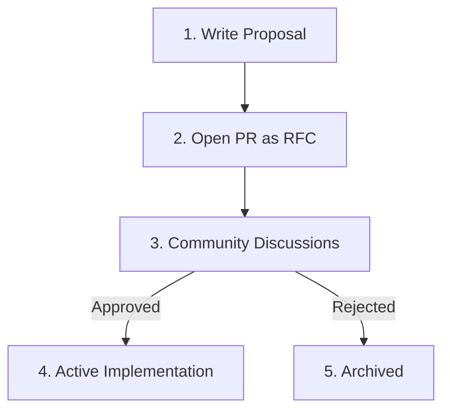

# Ray Request for Comments (RFC) Process

Major architectural changes, new plugin designs, and breaking API proposals must go through the Request for Comments (RFC) process to gather community feedback.

## 🛠️ Step-by-Step Flow



1. **Write the Proposal**: Use the RFC template below and write your design in a new file under `docs/rfcs/0000-my-proposal.md`.
2. **Open a PR**: Open a Pull Request on the main repository with `RFC:` prefix in the title.
3. **Discussions**: Community members and core maintainers review, discuss, and vote on the design.
4. **Resolution**: Once approved by at least 2 maintainers, the PR is merged and implementation begins.

---

## 📝 RFC Template

```markdown
# RFC: [Proposal Title]

- **Author**: [Your Name/Github]
- **Status**: Proposed
- **Date**: [YYYY-MM-DD]

## Summary
Provide a 2-3 sentence overview of what this change proposes to accomplish.

## Motivation
Why are we introducing this? What problem does it solve for users?

## Detailed Design
Outline technical implementation details, new API interfaces, and graph alterations.

## Drawbacks & Breaking Changes
List any compatibility implications or performance overheads.
```
