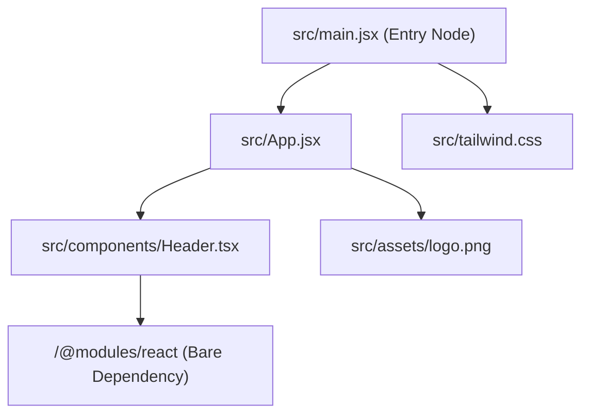
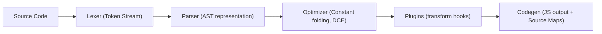
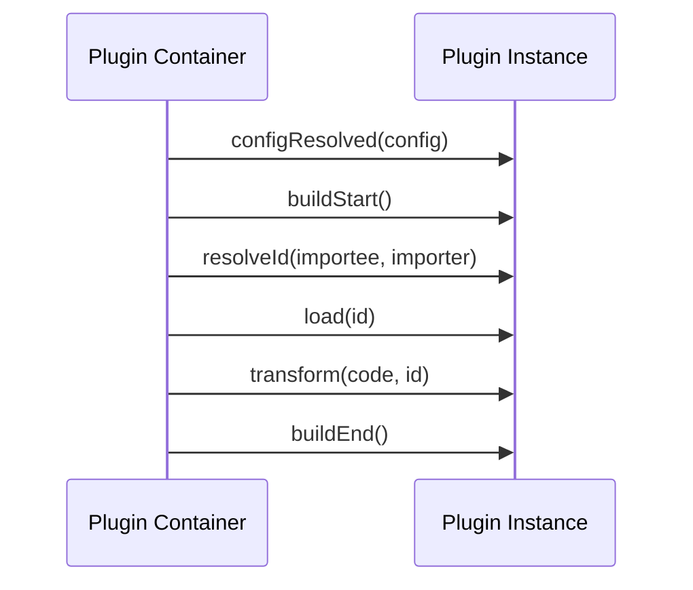
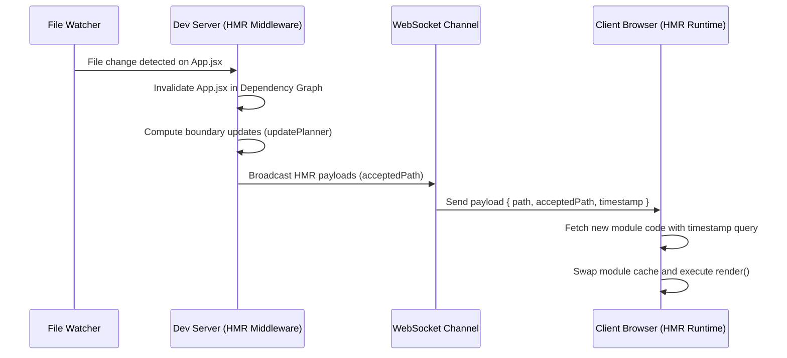
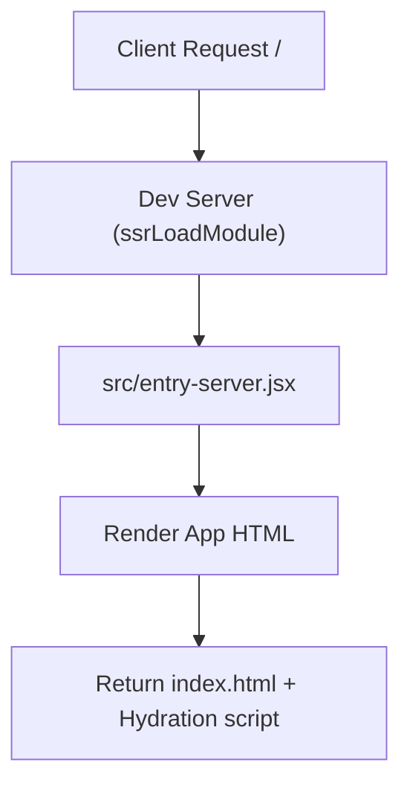
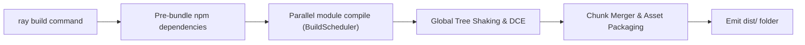

# Ray Architecture Documentation

This document describes the internals, graph representations, and key processing pipelines of Ray v1.0.

---

## 1. Module Graph

The **Module Graph** tracks the resolved relationships between dependencies and modules during live dev compilation and production build cycles.



---

## 2. Compiler Pipeline

The compilation pipeline routes JavaScript, TypeScript, JSX, and TSX files through distinct lexing, parsing, optimization, plugin transform, and code generation phases.



---

## 3. Plugin Lifecycle

The plugin container schedules and coordinates hooks during compiler startup, resolution, transformation, and shutdown.



---

## 4. HMR Flow

The HMR runtime processes watch notifications, computes update boundaries, invalidates changed modules, and pushes new code snippets to client websockets.



---

## 5. SSR Flow

Ray dynamically compiles server entries and exposes a node-side renderer to hydrate static markups.



---

## 6. Build Pipeline

The production builder compiles modules in parallel and merges outputs into optimized distributions.



---

## 7. Dependency Optimizer

The optimizer pre-bundles commonjs and esm packages to minimize browser network overhead.

```mermaid
graph TD
  Start["Dev server start"] --> Scan["Scan files for bare imports"]
  Scan --> CheckCache["Check cached metadata.json hash"]
  CheckCache -- Match -- > Dev["Serve immediately"]
  CheckCache -- Miss -- > Bundle["Pre-bundle bare modules via RayBundler"]
  Bundle --> Save["Write to .ray/cache and update metadata"]
```

---

## 8. Incremental Cache

The cache system hashes modules to optimize subsequent startup runs.

```mermaid
graph LR
  Source["Source Code changes"] --> Hash["Compute content SHA-256"]
  Hash --> CacheCheck["Lookup .ray/cache metadata"]
  CacheCheck -- Hit -- > Return["Load cached output and AST"]
  CacheCheck -- Miss -- > Compile["Run transform pipeline & save to cache"]
```

---

## 9. Ray Studio

Ray Studio provides visual telemetry insights, diagnostics graphs, and custom panel extendability.

```mermaid
graph TD
  Server["Dev Server Engine"] -- telemetry -- > WebSocket["WebSocket API Server"]
  WebSocket --> StudioHTML["Ray Studio Panel (studio.html)"]
  StudioHTML --> UI["Render Interactive Dev Telemetry Dashboards"]
```
